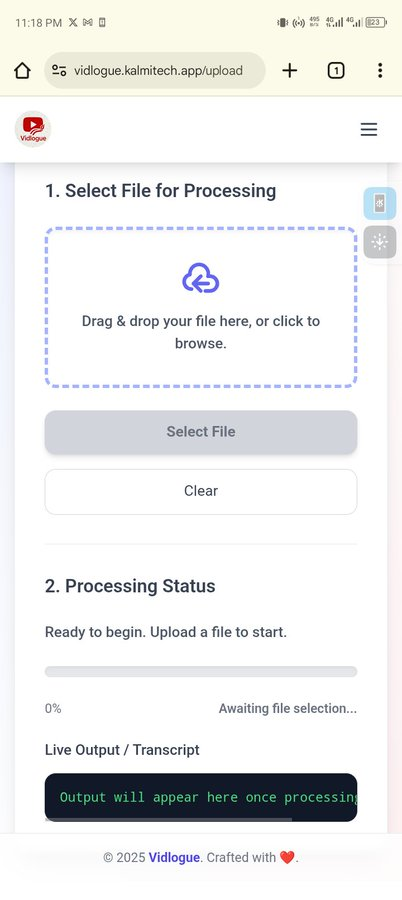
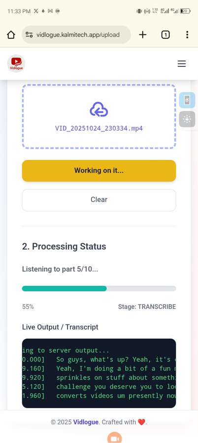
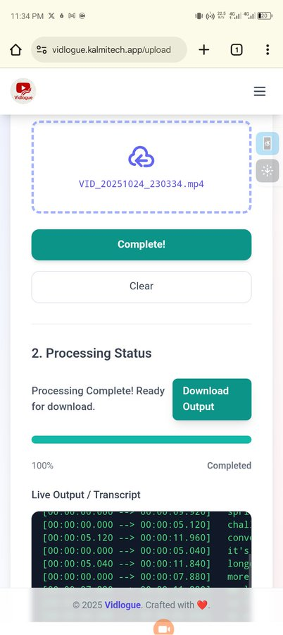
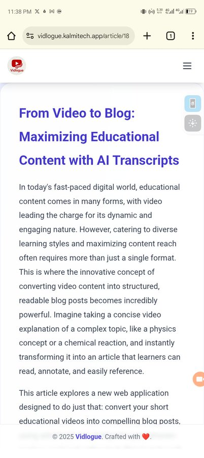
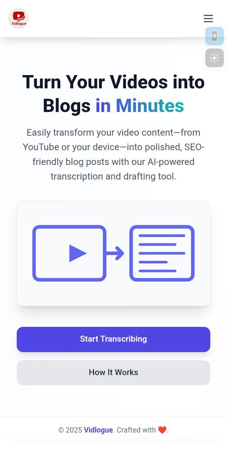
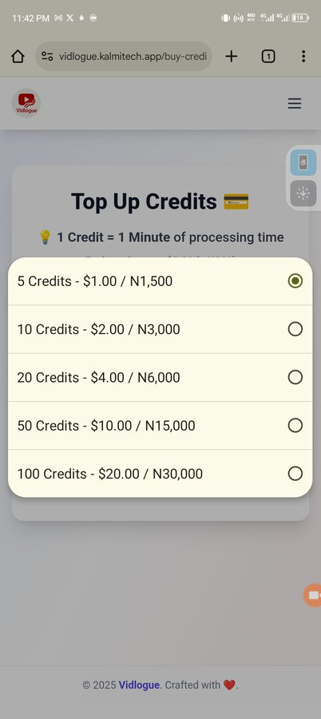

# Vidlogue

Vidlogue is a content repurposing platform built for creators who publish short-form videos (YouTube Shorts, TikTok, Instagram Reels) and want to convert them into structured, SEO-friendly long-form blog posts.

Instead of letting your short videos disappear in feeds, Vidlogue transforms them into searchable, reusable written assets.

---

## 🚀 How It Works

### 1️⃣ Upload Your Video

Upload your short-form video directly into the platform.

Your file is prepared and queued for processing.

---

### 2️⃣ Processing & Transcription

Vidlogue extracts the audio and performs real-time transcription while showing progress updates.

You can track the transformation from video to text as it happens.

---

### 3️⃣ Completed Output

Once processing is complete, your results become available.

You can:
- View the transcript  
- Access the generated blog  
- Download your content  

---

### 4️⃣ Blog Post Generation

Vidlogue doesn’t just output raw text.

It:
- Cleans the transcript  
- Structures it into readable sections  
- Formats it into a blog-ready layout  

The result is a publish-ready article you can export as Markdown.

---

### 5️⃣ Dashboard Overview

Manage everything from a central dashboard:

- Uploaded videos  
- Processing status  
- Generated blogs  
- Credit usage  

---

### 6️⃣ Credit-Based System

Vidlogue operates on a usage-based credit model:

- 1 minute of processed video = 1 credit  
- New users receive starter credits  
- Additional credits can be purchased  

---

## 🎯 Who It’s For

- Short-form content creators  
- Technical educators  
- Indie builders  
- Influencers building SEO presence  
- Anyone turning video into written authority  

---

## ✨ Core Features

- Video upload  
- Real-time transcription  
- Automated blog generation  
- Markdown export  
- Transcript download  
- Credit management  

---

## 💡 Vision

Short-form content captures attention.
Long-form content builds authority.

Vidlogue ensures your videos continue working for you long after they’ve been posted.

---

## 📣 Feedback

Feature suggestions and workflow improvements are welcome.

Let’s make content repurposing effortless.
